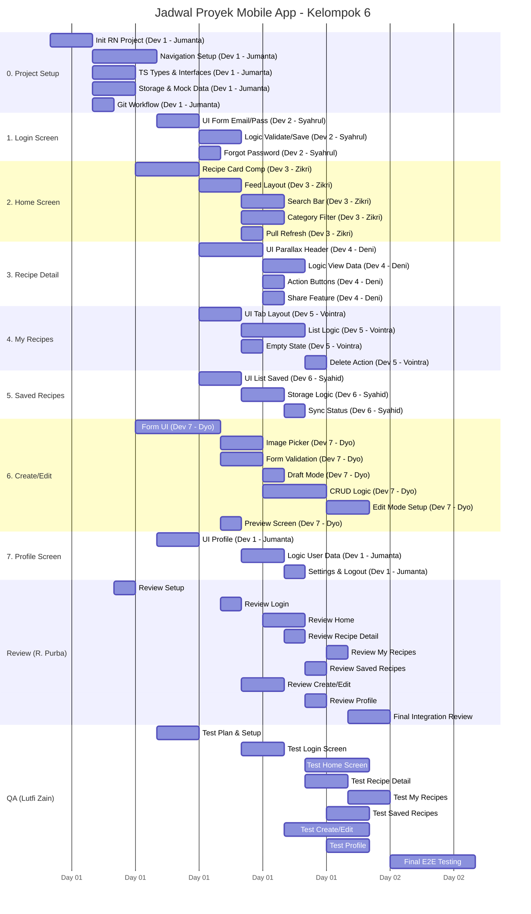

# Teams
|Role| Name| NIM|
|-|-|-|
|Dev 1| Jumanta| 1003240040|
|Dev 2| Syahrul Ramadhan| 1002230052|
|Dev 3| Zikri Firmansyah| 1003230043|
|Dev 4| Deni Hermawan| 1003230027|
|Dev 5| Vointra Namara Fidelito| 1002230062|
|Dev 6| Muhammad Syahid Azhar Azizi| 1003230019|
|Dev 7| Dyo Aristo| 1003230028|
|Reviewer| R. Purba Kusuma| 1002230076|
|PM + QA| Lutfi Zain| 1001230027|

# Timeline
